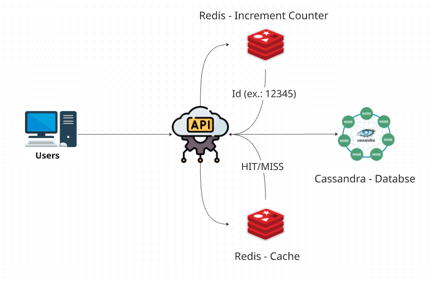
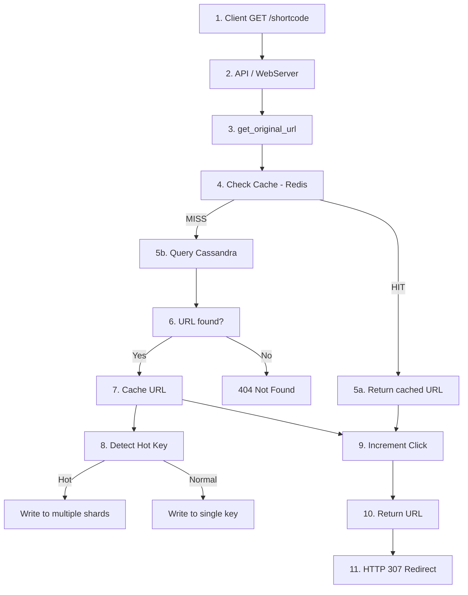
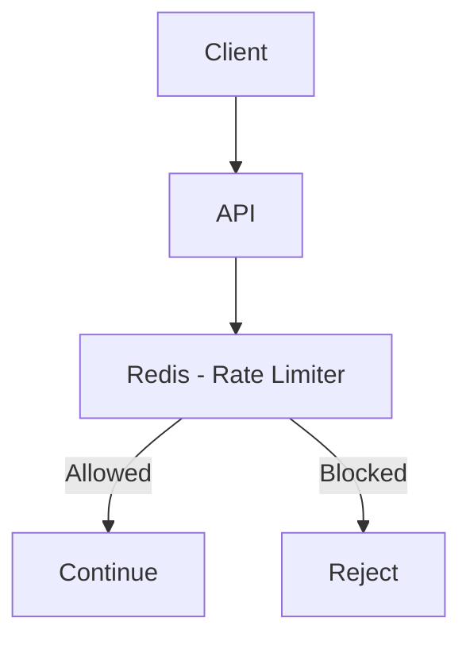

# 🔗 URL Shortener

<p align="center">
  
  
  
  
  
</p>

<p align="center">
  Sistema de encurtamento de URLs altamente escalável 🚀
</p>

---

## 📖 Sobre

Este projeto implementa um serviço de encurtamento de URLs similar ao Bitly, com foco em:

- Alta escalabilidade
- Baixa latência
- Alta disponibilidade
- Arquitetura distribuída

---

## ⚙️ Requistos

### Funcionais
  
  1. Encurtamento da URL: Dado um URL longo, retornar um URL muito mais curto
  2. Redirecionamento de URL: Dado um URL curto, redirecionar para o URL original

### Não Funcionais
  
  1. O tamanho da URL deve ser o mais curto possível
  2. Somente números (0-9) e caracteres (a-z, A-Z) são permitidos na URL
  3. URLs devem ser armazenadas por pelo menos 10 anos
  4. O sistema deve suportar 100 milhões de URLs geradas por dia
  5. O comprimento médio das URLs armazenadas deve ser de 100 bytes
---

## 🎯 Estimativas

 - Tempo de aramzenamento: 10 anos -> 100.000.000 * 365 * 10 = 365 bilhões de registros
 - Capacidade de aramazenamento: 100 bytes/url = 365 * 10ˆ9 * 100 = 36,5 Tb

### Calculo do Hash

0 - 9 -> 10 dígitos  
a - z -> 26 letras  
A - Z -> 26 letras  

Total = 62 caracteres -> base62  

Afabeto: ```0123456789ABCDEFGHIJKLMNOPQRSTUVWXYZabcdefghijklmnopqrstuvwxyz```  


| n (número de caracteres)    | Qtd máxima de URLs geradas |
| -------- | ------- |
| 1        | 62<sup>1</sup> = 62    |
| ...      | ...     |
| 4    | 62<sup>4</sup> = 14.776.336    |
| 5    | 62<sup>5</sup> = 916.132.832    |
| 6    | 62<sup>6</sup> = 56.800.235.548    |
| **7**    | **62<sup>7</sup> = 3.521.614.606.208**    |
| 8    | 62<sup>8</sup> = 218.340.105.584.896    |  


Para atendender o requisito não funcional 1 - O tamanho da URL deve ser o mais curto possível - devemos prosseguir com 7 caracteres no hash, pois é o menor número que possibilita exitirem 365 bilhões de URLs
Também, para evitar hashs pequenos e consequentemente mais fáceis de quebrar, podemos iniciar nosso id para a geração de hashs a partir de 15.000.000, onde teremos hashs com 5 caracteres em diante 

## 🧠 Arquitetura

<p align="center">
  
</p>

## 🧩 API & Fluxo de Requisições

### 🔗 POST /shorten

Cria uma URL encurtada a partir de uma URL original.  

#### Request Body
```json
{
  "original_url": "https://exemple.com"
}
```
#### Request Response  
```json
{
    "short_code": "lyAwmx",
    "original_url": "https://exemple.com",
    "created_at": "2026-04-16T10:50:25.557003"
}
```

flowchart TD
    A[1. Client POST /shorten] --> B[2. API / WebServer]

    B --> C[3. create_short_url]

    C --> D[4. Generate ID - Redis Counter]
    D --> E[5. Encode ID -> Base62]

    E --> F[6. Create URL Entity]

    F --> G[7. Save to Cassandra]

    G --> H[8. Return URL Object]

    H --> I[9. Response DTO]

    I --> J[10. Return Response to Client]

### GET /{shortcode}   

Redireciona para a URL original associada ao ```shortcode```.  

#### Response

```http
307 Found
Location: https://exemple.com
```  




## 🔄 Fluxo de Dados

### Criação

1. Cliente envia URL  
2. Redis gera ID incremental  
3. ID é convertido para Base62  
4. Persistência no Cassandra  
5. Retorno do shortcode  

### Redirecionamento

1. Cliente acessa shortcode  
2. API consulta Redis  
3. Cache HIT → retorna URL  
4. Cache MISS → consulta Cassandra  
5. Atualiza cache  
6. Retorna redirect  

---

## 🧠 Decisões de Arquitetura

### Cassandra

- Alta escrita (write-heavy)
- Dados não relacionais  
- Escalabilidade horizontal  
- Alta disponibilidade

### Redis

- Baixa latência  
- Cache distribuído  
- Contador incremental 

### Base62 + ofuscação de ID

- Base62 evita colisões ao mapear IDs numéricos únicos para um espaço maior de caracteres  
- Geração baseada em ID incremental garante unicidade (sem necessidade de hashing complexo)  
- Embaralhamento da Base62 + Salt evita previsibilidade dos códigos  
- Impede enumeração sequencial de URLs (ex: /abc123 → /abc124)  
- Dificulta scraping e descoberta de URLs privadas  
- Mantém URLs curtas, seguras e não sequenciais visualmente  

### Redirect 307

- Mantém método HTTP (mais correto semanticamente)  
- Evita cache agressivo no cliente  
- Garante que todas as requisições passem pela API  
- Permite coleta de analytics antes do redirecionamento  


## 🛡 Rate Limiting



---

## ▶️ Como rodar

### Pré-requisitos

- Python 3.10+  
- Docker + Docker Compose  
- Make  

---

### Setup completo

```bash
make setup
```

Isso irá:

- Instalar dependências  
- Subir Cassandra e Redis  
- Aguardar banco  
- Inicializar schema  

---

### Desenvolvimento

```bash
make dev
```

---

### Rodar API

```bash
make run
```

---

### Infra

```bash
make infra-up
make db-up
make redis-up
```

---

### Banco

```bash
make db-wait
make db-init
make db-shell
```

---

### Redis

```bash
make redis-shell
```

---

### Parar tudo

```bash
make down
```

---

### Qualidade

```bash
make lint
make format
make test
```

---


